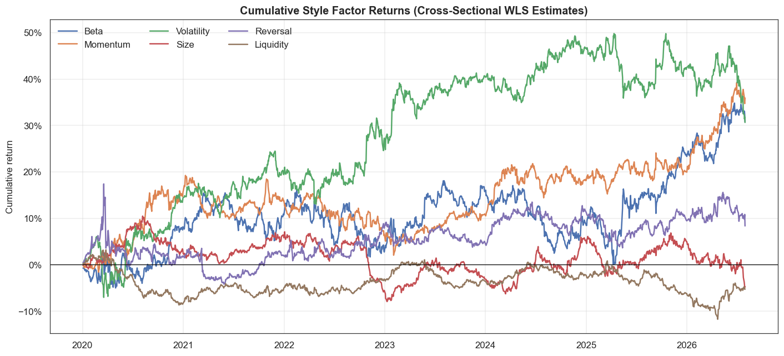
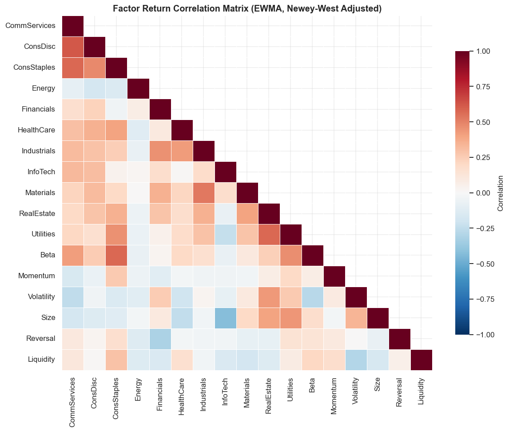
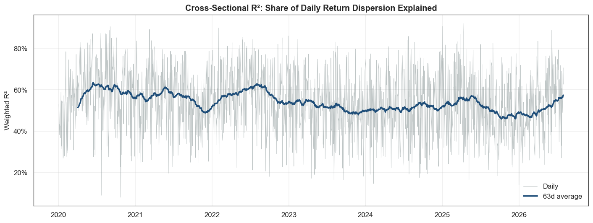
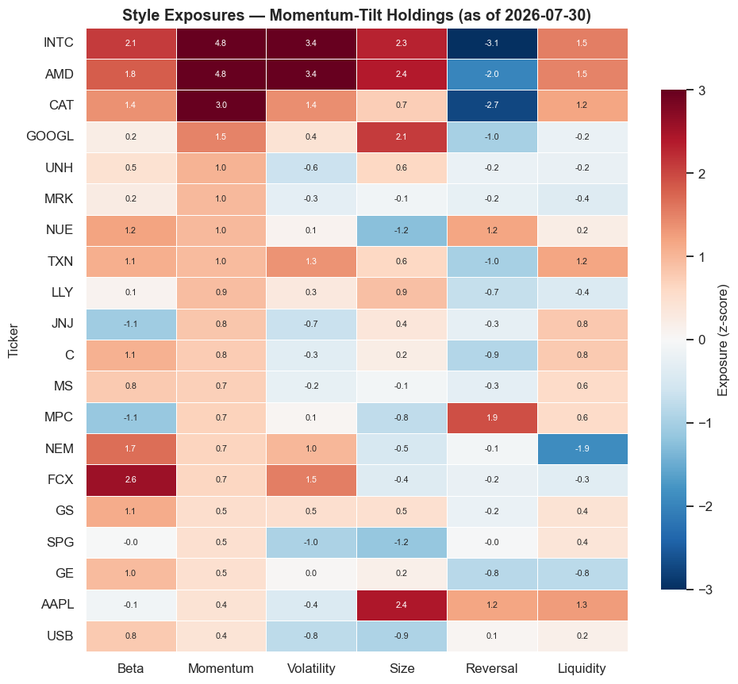
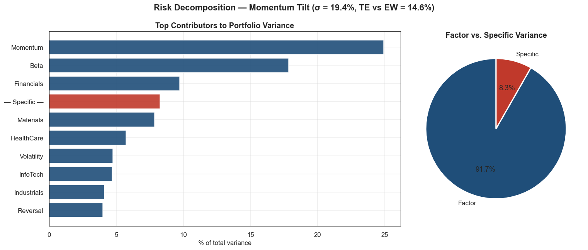
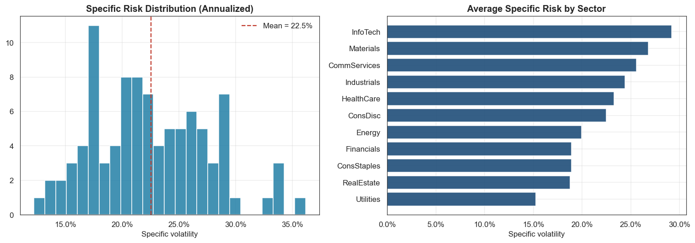
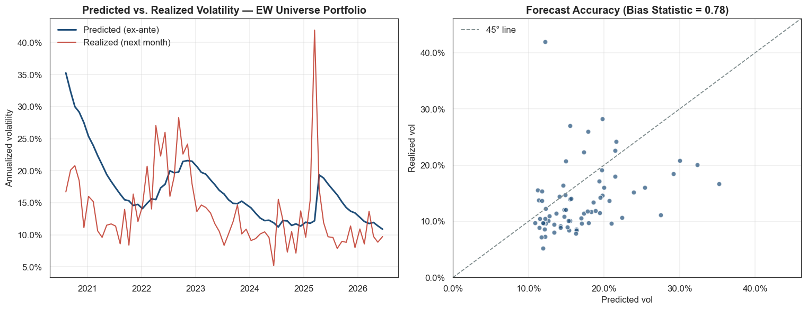
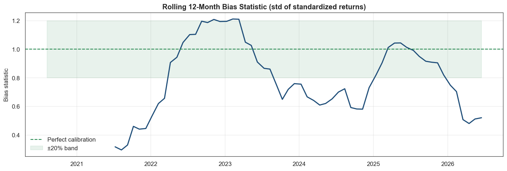

# Institutional Multi-Factor Equity Risk Model (Barra-Style)

A complete fundamental multi-factor equity risk model built from first principles, replicating the architecture of commercial risk models (MSCI Barra USE4, Axioma AXUS4).

The system estimates daily factor returns via cross-sectional weighted least squares over a ~94-name US large-cap universe, constructs an EWMA + Newey-West factor covariance matrix and a shrunk specific-risk model, assembles the full asset covariance matrix, and uses it to decompose portfolio risk, compute ex-ante tracking error, and validate forecasts out-of-sample with bias statistics.

**17 factors:** 11 GICS-style industry factors + 6 style factors (Beta, Momentum, Volatility, Size, Reversal, Liquidity), all built point-in-time with exposures lagged one day relative to the returns they explain.

---

## Repository contents

| File | Description |
|---|---|
| `barra_risk_model.ipynb` | Full Colab / Jupyter notebook (markdown + code cells) |
| `barra_risk_model.py` | Same pipeline in percent-cell format (version-control friendly) |
| `figures/` | Exported PNG charts for this README |

No API keys required. If Yahoo Finance is unavailable, a factor-structured synthetic market is generated automatically so the notebook still runs end-to-end.

---

## Quick start

```bash
pip install numpy pandas matplotlib seaborn yfinance
# Jupyter / Colab
jupyter notebook barra_risk_model.ipynb
# or run as a script
python barra_risk_model.py
```

**Libraries:** `numpy`, `pandas`, `matplotlib`, `seaborn`, `yfinance` (optional given the synthetic fallback). WLS, Newey-West, and shrinkage are implemented from scratch — no statsmodels/sklearn dependency.

---

## Why this matters

Multi-factor risk models are the risk backbone of institutional equity management:

- **Portfolio construction** — optimizers consume `Σ = BFBᵀ + D` directly; factor models make the N×N covariance estimable and PSD
- **Risk budgeting** — desks set limits on factor and sector exposures measured against this exposure matrix
- **Ex-ante tracking error** — benchmark-relative mandates are governed by predicted TE from models of this type
- **Attribution** — realized P&L is split into factor vs. stock-specific components
- **Hedging** — market-neutral funds neutralize selected factor exposures so residual P&L is idiosyncratic alpha

---

## Architecture

```
LAYER 1 — DATA
  yfinance download (retry + validation) ──► synthetic fallback
  cleaning: sparse-ticker drop, gap ffill (≤5d), return clipping
           │
LAYER 2 — EXPOSURES  (all lagged t−1, point-in-time)
  6 style descriptors ──► XS z-score ► winsorize ±3σ ► re-std
  11 industry dummies (partition ⇒ absorbs the intercept)
           │
LAYER 3 — ESTIMATION
  daily XS WLS:  r_t = B_{t−1} f_t + ε_t   (√ADV weights)
  outputs: factor returns f_t, residuals ε_t, weighted R²
           │
     ┌─────┴─────┐
LAYER 4a — FACTOR COV     LAYER 4b — SPECIFIC RISK
  EWMA (HL=90d)             EWMA vol of ε (HL=60d)
  + Newey-West (2 lags)     + shrinkage to XS mean (25%)
  + PSD eigenvalue clip
     └─────┬─────┘
           │
LAYER 5 — RISK MODEL      Σ = B F Bᵀ + D
  portfolio vol · Euler risk decomposition · tracking error
           │
LAYER 6 — VALIDATION & REPORTING
  walk-forward monthly bias statistics · 8-chart visual suite
```

---

## Style factor construction

| Factor | Construction | Window |
|---|---|---|
| Beta | rolling cov(rᵢ, r_mkt)/var(r_mkt) vs. EW universe | 252d |
| Momentum | P(t−21)/P(t−252) − 1 (12-1 convention) | 252d |
| Volatility | realized σ × √252 | 63d |
| Size | log(mean dollar volume) — point-in-time mcap proxy | 63d |
| Reversal | trailing 21d return | 21d |
| Liquidity | log(ADV₂₁ / ADV₁₂₆) | 21/126d |

Each descriptor is cross-sectionally standardized per date: z-score → winsorize ±3σ → re-standardize. Everything is lagged one day before entering the regression.

---

## Core algorithms

1. **Fundamental factor model** — industry dummies + mean-zero style exposures
2. **Cross-sectional WLS** — √ADV weights, rank-preserving industry drop on empty sectors
3. **EWMA covariance (HL = 90d) + Newey-West** — Bartlett-weighted autocovariance (2 lags), annualized ×252
4. **PSD projection** — eigenvalue clipping for optimizer-safe covariance
5. **Specific risk** — EWMA residual vol (HL = 60d) with 25% shrinkage to the cross-sectional mean
6. **Euler risk decomposition** — factor contributions sum exactly to factor variance
7. **Ex-ante tracking error** — √(wₐᵀ Σ wₐ) on active weights
8. **Bias statistic** — walk-forward monthly zₜ = r_{t+1}/σ̂ₜ; std(z) ≈ 1 when calibrated

---

## Results & charts

Sandbox / synthetic-fallback run highlights: **1,246** daily cross-sections, mean weighted R² **~31%**, min eigenvalue **> 0** (PSD enforced), bias statistic **~0.92** over 52 monthly forecasts — within the 0.8–1.2 calibration band.

### 1. Cumulative style factor returns

Cross-sectional WLS estimates of the six style factors over the sample.



### 2. Factor return correlation matrix

EWMA + Newey-West adjusted correlations across 11 industry and 6 style factors (lower triangle).



### 3. Cross-sectional R²

Share of daily return dispersion explained by the factor structure, with a 63-day smoother.



### 4. Style exposures — momentum-tilt holdings

Z-scored style exposures for the sample 20-name momentum-tilt portfolio.



### 5. Risk decomposition

Top contributors to portfolio variance and the factor vs. specific split, with total vol and TE vs. the EW benchmark.



### 6. Specific risk landscape

Distribution of annualized idiosyncratic volatility and averages by sector.



### 7. Predicted vs. realized volatility

Walk-forward ex-ante forecasts against next-month realized vol, plus a calibration scatter (45° line).



### 8. Rolling 12-month bias statistic

Standard deviation of standardized returns; the green band marks ±20% around perfect calibration (1.0).



---

## Performance metrics

| Metric | What it measures | Target / typical |
|---|---|---|
| Mean weighted cross-sectional R² | Daily return dispersion explained | ~20–40% daily (real US large-cap) |
| Factor t-stats / Sharpe | Economic significance of premia | Style \|t\| ≈ 2 → meaningful |
| Covariance condition number | Numerical stability for optimizers | < 10⁴ comfortable |
| Min eigenvalue | PSD guarantee | > 0 (enforced) |
| **Bias statistic** | Volatility forecast calibration | 0.8–1.2 acceptable; ≈ 1.0 ideal |
| Pred/realized vol correlation | Tracks vol *dynamics*? | > 0.5 desirable with real data |
| Ex-ante TE | Benchmark-relative risk | Sanity vs. realized active vol |

---

## Pipeline walkthrough

1. Environment setup, plotting theme, frozen `ModelConfig`
2. 94-name universe and GICS-style sector map
3. Download prices/volumes with retry + coverage validation (or synthetic fallback)
4. Clean — drop sparse tickers, forward-fill short gaps only, clip data-error returns
5. Six style descriptors → XS z-score → winsorize → re-standardize
6. Daily cross-sectional WLS with √ADV weights and lagged exposures
7. Factor analytics — annualized premia, vols, Sharpes, t-stats
8. EWMA factor covariance + Newey-West + PSD clip
9. Specific risk via EWMA residual vol with shrinkage
10. Assemble `RiskModel` (`Σ = BFBᵀ + D`)
11. Momentum-tilt portfolio: vol, Euler decomposition, ex-ante TE
12. Walk-forward validation — predicted vs. realized vol, bias statistic
13. Eight-chart visualization suite + console summary report

---

## Data sources

| Source | Data | Role |
|---|---|---|
| Yahoo Finance (`yfinance`) | Adjusted close, volume, ~2019–present | Primary price/volume panel |
| Built-in synthetic generator | Factor-structured simulated panel | Offline fallback |

**Cleaning highlights:** drop tickers missing >10% of prices; forward-fill gaps ≤5 days only (never back-fill); restrict to dates where ≥90% of the universe trades; clip returns at ±50%.

---

## Potential upgrades

- Point-in-time index constituents (remove survivorship bias)
- SEC EDGAR XBRL fundamentals → Value / Quality / Earnings Yield
- True point-in-time market cap for Size and √mcap regression weights
- Country/Market factor with the Barra industry constraint (USE4 formulation)
- Volatility Regime Adjustment (VRA) and eigenfactor risk adjustment
- Feed Σ into a `cvxpy` mean-variance optimizer with factor-exposure bounds
- Refactor into a `src/riskmodel/` package with `pytest` and CI on the synthetic pipeline
